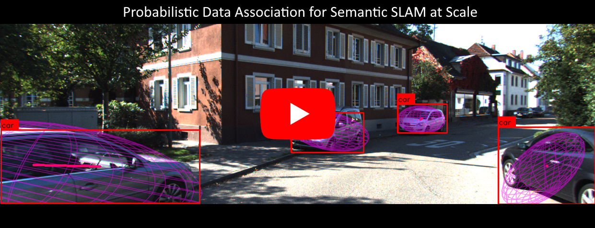

## Probabilistic Semantic Slam
This repository contains code for two separate tasks:

  The modelling / extraction of semantic assignment problems from the KITTI SLAM dataset

  The comparison / computation of probabilistic slam weights as described in the publication cited below
  
This is also, ideally, a time-saver for anyone trying to develop a semantic SLAM framework of their own, as the framework of semantic data extraction is a central part of a full SLAM framework. The assignment code is also well isolated, ideally making it simple to lift and place into other frameworks as desired. 

## Motivation
Semantic measurements are more human readable, unique/sparse in the environment, and higher information than pixel/geometric measurements. They are also more robust to lighting/viewpoint changes, a car is a car at day or night, from the left or the right. Probabilistic assignment allows for robust assignment in the face of uncertainty without throwing away any measurements, which is a requirement when there are only 3-5 measurements per frame! The only other work in the literature doing this used the matrix permanent, which is computationally infeasible for anything but tiny problems, and wasn't open source. I aimed to fix both of those problems.

## Video / Pictures

[](https://youtu.be/-yuNgoN7JAI)


## Installation & Prerequisites
This code is built primarily on [GTSAM](https://github.com/borglab/gtsam), [GTSAM-QUADRICS](https://github.com/best-of-acrv/gtsam-quadrics), Eigen and OpenCV(C++ and Python). For plotting, I have used [Matplot++](https://alandefreitas.github.io/matplotplusplus/). 

If you are interested in just the code which computes the probabilistic assignment weights (located in assignment.cpp, and shortestPath.cpp), then none of the previously cited prerequisites are needed, except for potentially Eigen (depending on usage).

## Compilation
I use CMake for compilation, and have included the cmake file which works with my installation of the prerequisites, but your installation of the required packages will almost surely change the format of the CMake file. 

## How to use?
The code is set up to run on the KITTI dataset. It could "easily" be converted to any other dataset, but a different data pipeline would have to be set up. As it is, download the [KITTI odometry dataset](http://www.cvlibs.net/datasets/kitti/eval_odometry.php) (laser data not needed) and fill in the correct path to the dataset at the top of kittiReader.cpp . 

With all prerequisites installed, CMake configured and the KITTI data downloaded, run in the top level:
```sh
$ mkdir build
$ cd build
$ cmake ..
$ cmake --build .
```
Which should create 2 executables, semSlamRun (the semantic SLAM data extraction), and compMethods (for comparing the assignment and permanent methods). 

To use, run the following command (in the build directory, or if desired, run from above the build directory and add build/ to the executable path)
```sh
$ ./semslamRun
```
For an explanation of the run options, see the beginning of system.cpp

To run the assignment comparison code, in the same folder run
```sh
$ ./compMethods o30_p0_k200_perm0_net1
```
where "o30_p0_k200_perm0_net1" is the default ID string from the default semslamRun code.

## Code Structure

A vague initiation to the structure of the code to get you started:
  - system.cpp: The hub for all of the code, the main driver of everything
  - kittiReader: Extracts images and odometry from KITTI dataset
  - bbNet: Loads neural network from nets folder, feeds images to it correctly, reads output
  - dataframe: All of the images, measurement extraction, measurements from a single stereo frame
  - assignment: Interface between the SLAM framework (measurements) and the assignment code (cost matrices)
  - shortestPath: Compute the k-best assignments
  - nwPerm: Compute the matrix permanent
  - slidingWindow: handles the measurements/landmarks within the sliding window for SLAM estimation
  - comparison: Compares the assignment method and permanent and generates comparison graphs (shown above)

## Publication
[Elad Michael, Tyler Summers, Tony A. Wood, Chris Manzie, and Iman Shames. "Probabilistic Data Association for Semantic SLAM at Scale." arXiv preprint arXiv:2202.12802 (2022).](https://arxiv.org/pdf/2202.12802.pdf)

### I'm happy to answer questions, just reach out!
